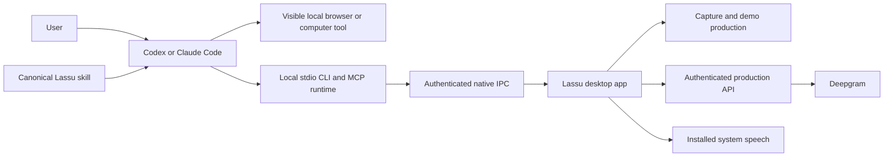

# Lassu AI video integration engineering design

Status: implementation in progress. Repository packaging and native product changes have separate acceptance gates. A design requirement is not a claim that a shipping app already implements it.

## 1. Product contract

A signed-in Lassu desktop user asks Codex or Claude Code for a daily update, feature walkthrough or tutorial. The agent operates a visible local app, records it with Lassu, produces concise narration, reviews the result and returns a playable video. The user does not write a script, edit a timeline or approve an intermediate draft.

Daily updates and ordinary tutorials should generally be shorter than 300 seconds. This is a soft editorial preference. Short content must not be padded, and essential information must not be cut merely to meet that duration. Capture safety limits and account quotas are separate constraints.

The normal path is brief preflight, one capture, one production pass, agent review and upload. Reuse unchanged speech and valid work. Permit a targeted repair when review finds a concrete problem. Measure total latency separately from capture, TTS, rendering and upload; never imply rendering time is the complete task duration.

## 2. Architecture and ownership



The public repository owns instructions, compatibility metadata, generated plugin manifests, packaging and contributor workflows. The product repository owns native capture, runtime binaries, installers, authenticated IPC, voice routing, rendering, release signing and backend services. Public CI never checks out private source or receives product signing credentials.

The app owns local permissions and account credentials. The backend owns entitlement, authorization, rate limits and provider keys. The host owns tool approval and browser control. Skills guide behavior and are not security boundaries.

## 3. User installation

The preferred product experience is Lassu Preferences > AI access > Connect Codex or Connect Claude Code. The app installs or activates its private runtime, registers MCP through supported client configuration, and installs personal skills if the host does not already own a Lassu plugin. Codex desktop users must not need a separate Codex CLI.

The public plugin is an optional instruction distribution path. It does not contain a fixed application path or another MCP registration. Git marketplace users install the same generated skills. Archive users can install personal skills without Git, npm or Python. Never install both plugin and personal copies silently.

Connection status distinguishes downloaded, installed, configured, loaded by the host, authorized by the host, connected to the app, and capture-ready. A successful local MCP initialization does not prove that Codex or Claude Code has loaded it. Do not make an agent call or paid TTS request just to prove installation.

First-time OS screen permissions, app login, target-site login and host tool consent remain explicit user interactions. They cannot be bypassed by an installer.

## 4. Runtime packaging

Production users do not install Node.js. Build one self-contained Node 22 single-executable application containing the CLI and MCP server. Bundle dependencies as CommonJS, remove top-level await from the entry point, disable snapshots and code cache, and inject the blob into the exact matching Node binary. Build on the native target architecture. A standalone executable contains a private runtime; it is not a global Node installation.

A stable launcher resolves an immutable versioned runtime. The preferred delivery is an app-managed component download on first connection; an app-bundled runtime is an acceptable migration stage and offline installer option, provided its size is disclosed and it removes external runtime requirements. The native app must be able to download and verify the component without depending on the missing runtime itself.

macOS targets arm64 and x64, macOS 14 or newer. Windows targets x64 and ARM64 on Windows 11 build 22631 or newer. Linux packaging validation does not imply a Linux desktop app. WSL, cloud-hosted agents, remote interactive sessions and Session 0 are outside the first release unless separately validated.

Windows retains its native IPC helper. The JavaScript transport must not bypass owner ACL, server process identity and interactive-session validation by opening the named pipe directly. Include the helper and its required self-contained .NET files in the same immutable component payload.

Suggested private component layout, rooted through native user-data APIs:

```text
AI/
  bin/lassu[.exe]
  versions/cli-<version>/lassu-runtime[.exe]
  versions/cli-<version>/ipc-helper/
  versions/browser-<version>/
  state/active.json
  state/receipts/
  state/transactions/
  staging/
```

Resolve the active version once per process. Never overwrite a running Windows executable. Update a native launcher after its related processes exit. PATH integration is optional and is not needed by the AI host's absolute MCP command.

## 5. Host configuration

Codex uses its supported user MCP configuration, normally `~/.codex/config.toml`, respecting `CODEX_HOME` and selected profiles. Its personal skills normally live in `~/.agents/skills`. Preserve comments, unknown keys and unrelated servers; reject unsupported layouts rather than rewriting the whole file. A documented CLI may be used if already installed, but it is not a desktop prerequisite.

Claude Code uses its supported user MCP scope. When invoking its CLI, pass structured arguments: `claude mcp add --scope user --transport stdio lassu -- <absolute executable> mcp serve`. Do not use shell interpolation. Respect `CLAUDE_CONFIG_DIR` and the selected profile. Claude Desktop is a different host and must not be confused with Claude Code.

Track `skillOwner=lassu|host|user` and a separate receipt per host/profile. Receipts include installed version and hashes, never account secrets. A plugin owned by the host is updated by the host. App-managed skill files are updated only while unchanged from their receipt. A user-modified or unrelated file produces an actionable conflict; it is not silently replaced.

Configuration changes are transactions: stage and validate, record a private journal, check the current file again, replace atomically, install the matching skills, verify, then write a receipt. Multi-file changes are not filesystem-atomic. Recover interrupted work from the journal. Retain private backups for seven days. A pre-write hash check is not a compare-and-swap primitive; defer if the host is concurrently writing and a shared lock is unavailable.

Uninstall removes only unchanged files and entries owned by this installation. Never delete videos, browser profiles, unrelated servers, authentication state, trust settings or user customizations.

## 6. Public repository layout

```text
skills/lassu-record-video/SKILL.md
skills/lassu-record-video/references/
skills/lassu-edit-screenshot/SKILL.md
skills/lassu-edit-screenshot/references/
plugins/lassu/.codex-plugin/plugin.json
plugins/lassu/.claude-plugin/plugin.json
plugins/lassu/skills/
.agents/plugins/marketplace.json
.claude-plugin/marketplace.json
compatibility.json
VERSION
scripts/package.py
tests/
.github/workflows/
```

`skills/` is canonical. The package script generates host manifests, marketplace files and plugin skill copies. CI fails when generated output differs. The plugin carries no `.mcp.json`, hooks, API key, Mac-only path or downloaded executable. Each skill directory includes its own referenced files so personal installations are self-contained.

Archives are sorted, have fixed timestamps and modes, use normalized line endings, and are compared byte-for-byte across platform CI jobs. Release metadata includes version, sizes and SHA-256 digests. Provenance authenticates the GitHub build source; checksums alone only detect corruption.

## 7. Update protocol

Version independently: app/build, launcher, CLI, skills, optional browser component, IPC protocol range, workflow version and demo schema. Resolve a compatible set using platform, OS version, launcher version, app capabilities, host version and protocol range. Keep the current and previous supported app contracts available during migration.

The app checks for updates while running, approximately every six hours with jitter. MCP startup does not wait for network update checks. Pin active process and demo versions. Do not restart the app or replace a renderer during recording, rendering or upload; integrate these busy-state guards with Sparkle and Velopack.

Proposed public endpoints:

```text
GET /ai-updates/v1/stable/index.json
GET /ai-updates/v1/beta/index.json
GET /ai-artifacts/<component>/<version>/<platform>/<file>
```

Serve public components from the release bucket, separate from customer media. Support HEAD, bounded metadata, ETag and range requests. Public downloads do not require an account. TTS remains authenticated.

Authenticate metadata with a pinned ES256 P-256 public key. The envelope contains a base64 payload and a raw 64-byte R||S signature over the exact decoded payload bytes, plus a key identifier. Validate signature before parsing trusted instructions. Enforce schema, issued/expiry times, monotonically increasing sequence, platform and size limits. Rotation uses an already trusted key or an app update. Do not invent a production key or publish unsigned metadata under a production channel.

Every artifact is immutable, digest-checked and checked against the expected OS signing identity. Reject archive traversal, absolute paths, links/reparse points and expansion beyond declared limits. Download to private staging, verify, extract, run a non-recording health check, and atomically activate. On failure retain the previous active version. Offline use can continue with a previously verified compatible component; this does not imply the entire service is offline-capable.

Rollback publishes a new signed sequence pointing to a known-good version; it does not reuse old metadata or mutate a tag. Retain current, previous and all active-job versions. Garbage-collect only unreferenced component versions after seven days, never user recordings.

## 8. Browser integration

Reuse a host browser/computer tool when it controls the actual local visible window. Verify the source before capture. Browser availability cannot be inferred from a plugin installation or from a remote tab.

If required, ship a separately versioned fixed Playwright MCP component running under the private runtime. Load only verified component paths; do not evaluate arbitrary downloaded JavaScript. Use installed Chrome or Edge in headed mode, avoiding a bundled Chromium download by default. Bundle the pinned server's resources and test the resulting artifact, not just an import from a developer checkout.

Use a dedicated profile when the tool requires one. Do not copy cookies from an existing user profile. Enforce one owner per profile/session and do not take over another active browser. Login requirements remain visible to the user. Official host browser integrations have their own account and OS restrictions; verify them against current vendor documentation.

## 9. Demo production contract

Tools include create, update, finalize and get demo operations. A draft has a stable identity, owner, revision, source capture, concrete selected voice and one to twenty ordered non-overlapping scenes. Retained ranges use half-open actual media-time intervals and exclude paused time. Gaps remove setup, loading and redundant navigation.

The agent briefly verifies the route, selects an intended source, starts capture with an explicit safety bound, waits for the first frame, marks meaningful boundaries, performs real actions and always stops capture. Capture failures preserve a recoverable private draft when possible.

Narration describes purpose, action and visible result in natural sentence groups. Avoid greetings, promises, every cursor move and repeated conclusions. Use only observed or verified facts. For live hotel prices, identify displayed dates and currency and avoid implying a booking was made.

Focus bounds are normalized to the captured raster, not a guessed browser viewport. Apply restrained zoom and eased transitions only when they improve legibility. Preserve enough context to understand actions. Default output does not require music, title cards, sound effects or zoom on every click.

Finalization first prepares and renders a private review rendition. At most two speech segments synthesize concurrently. Cache keys include the concrete voice, provider, text and synthesis settings. Reuse unchanged speech. Validate scene fit, source ranges, decodable frames, audio energy/clipping and expected duration. A contact sheet cannot prove every frame or spoken word is correct; inspect an affected section when there is a concrete concern.

Commit requires the exact inspected revision. A changed revision requires a new review. Upload only the reviewed rendition and poll until playback is ready. Preserve privacy and share only to the intended audience. Never claim a queued, silent or missing rendition is complete.

## 10. Voice routing and backend security

The app first asks the authenticated backend for the target language's actual catalog support. If supported, select backend TTS. If unsupported, choose an installed system voice in the same primary language, preferring exact locale and then quality. Persist the concrete selection so retries keep one voice.

Authentication failures, disabled service, provider errors, rate limits and network failures are not a negative language-support response. They must not silently trigger system fallback. If neither backend nor installed voices support the language, report the missing capability without changing the language or downloading a voice automatically.

Deepgram credentials exist only in backend configuration. Verify the app access token's signature, issuer, audience, expiry and live unrevoked account session. For browser-cookie endpoints, enforce origin/CSRF rules. Validate ownership of optional recording references. Apply atomic per-user limits across backend replicas and fail closed if the limit store is unavailable. Bound text, request body, synthesis concurrency, provider response and timeouts. Sanitize errors and never log credentials or full private narration by default.

## 11. Native platform work

macOS uses native capture, AV speech, composition/export and the existing review pipeline. New runtime packaging must preserve app signing, notarization and screen-permission behavior.

Windows needs native parity for draft persistence, demo coordination, voice routing, installed system speech, rendering and media QA before advertising `demo_production`. Evaluate MediaComposition/MediaEditing and Win2D against the actual WinUI distribution; use a native Media Foundation fallback if needed. Verify audio timing, zoom, hardware/software encoding and cancellation on physical x64 and ARM64 hardware. Do not require users to install FFmpeg or a language runtime.

The native build pipeline must compile all supported architectures and smoke-test the actual packaged executable. Cross-platform instruction CI is not a native recording test. A Windows build that passes on a service runner does not prove visible desktop capture or browser interaction works.

## 12. CI, release and repository governance

Feature branches target `dev`. Promote `dev` to protected `main` through a reviewed PR. All content and commits are English. Keep both long-lived branches; reconcile history after a squash promotion. Use a stable required gate so failed or skipped matrix jobs cannot disappear from branch protection.

Public CI runs on macOS arm64/x64, Windows arm64/x64 and Linux. It validates source, local references, English-only content, compatibility, generated files, deterministic packaging and archive checksums. Fork checks are read-only. Pin Actions by commit and use Dependabot for reviewed updates.

The release workflow accepts only `main`, reruns the matrix, compares exact artifacts, attests them and creates a draft release behind a protected environment. Publishing is a separate reviewed action. Production native signing secrets remain in the private product repository. Missing Windows signing or update-key credentials block production release rather than producing a false success.

Roll out a compatible backend first, then immutable component candidates, the matching app, skills and finally the signed stable index. Use measured staged rollout cohorts such as 5%, 25% and 100%, with rollback thresholds. An official vendor plugin catalog is optional distribution; do not claim an unsubmitted plugin is listed.

## 13. Performance budgets

These are targets to validate, not measured promises:

| Metric | Target |
| --- | --- |
| Compressed skills | Under 1 MiB |
| CLI component download | Under 50 MiB on macOS, under 80 MiB on Windows if feasible |
| Optional browser server, excluding browser | Under 15 MiB if feasible |
| Warm MCP startup | Under 2 seconds |
| Idle memory per host | Under 100 MiB if feasible |
| Warm configuration | Under 5 seconds |
| Cold setup at 100 Mbps | Under 60 seconds, excluding login and permission prompts |
| Ordinary video | Concise, generally below 300 seconds |

Record actual sizes, peak memory and latency by architecture. Do not hardcode a total production-time promise before measuring speech, export, network and host action delays.

## 14. Acceptance and rollout gates

Pass one checks normal behavior and artifact integrity. Pass two checks failure, conflict, interruption and release paths independently. Keep the observed results in `VALIDATION.md`; an unrun case stays unrun.

Required integration cases: fresh app-only Codex with no CLI/Node/Python/Git, Claude Code user scope, non-default profiles, paths containing spaces and non-ASCII characters, relocated app, existing unrelated MCP entry, user-modified skills, duplicate plugin ownership, concurrent host writes, uninstall preservation, app closed, revoked AI access and new-session pickup.

Required update cases: first install, unchanged version, compatible upgrade, incompatible protocol, expired or replayed metadata, wrong signature/key/platform, corrupt artifact, oversized/traversing archive, interrupted download/extraction/activation, offline startup, active capture/render/upload, rollback, busy Windows executable and safe garbage collection.

Required production cases on each supported architecture: localhost daily update, Fullerton Google Hotels tutorial, supported backend language, unsupported-language system voice, unavailable system voice, backend authentication/rate-limit/outage errors, speech overflow, revision conflict, interrupted capture, private upload, reviewed commit, and playable result with correct audio and focus.

Implementation sequence: executable feasibility; public source/distribution; native connect and verified component updates; Windows demo parity; optional browser fallback; all-platform production acceptance; signed release rollout. Shipping an intermediate stage must state its remaining limitations.

## 15. Primary references

- [Node.js single-executable applications](https://nodejs.org/download/release/latest-jod/docs/api/single-executable-applications.html)
- [Codex MCP configuration](https://learn.chatgpt.com/docs/extend/mcp?surface=cli)
- [Codex skills](https://learn.chatgpt.com/docs/build-skills)
- [OpenAI plugin packaging](https://developers.openai.com/plugins/build/plugins)
- [Claude Code skills](https://code.claude.com/docs/en/skills)
- [Claude Code plugin installation and updates](https://code.claude.com/docs/en/discover-plugins)
- [GitHub-hosted runner architectures](https://docs.github.com/en/actions/reference/runners/github-hosted-runners)
- [Microsoft Playwright MCP](https://github.com/microsoft/playwright-mcp)
- [Video TalkCraft inspiration](https://github.com/Vincentwei1021/video-talkcraft)

The useful production pattern is to separate real capture from concise narration and editorial timing, then automatically compose and review the result. Lassu retains its own native capture, account security and local host integration rather than copying another product's deployment assumptions.
